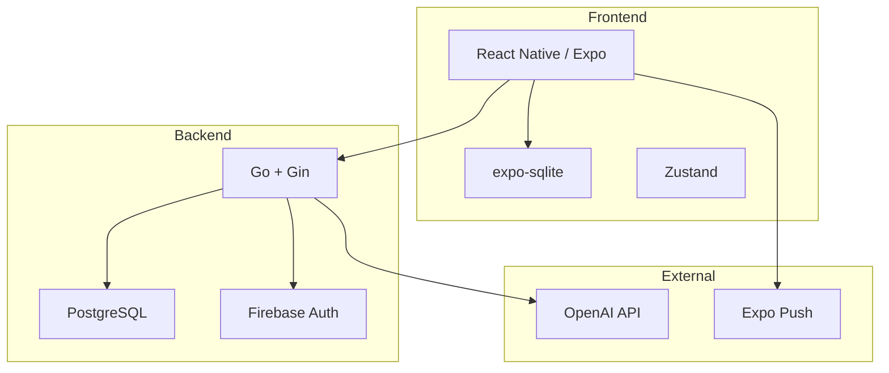

# COFFEE RECIPE HUB 技術選定書

## 1. 技術スタック概要

| レイヤー           | 技術                | 選定理由                                    |
| :----------------- | :------------------ | :------------------------------------------ |
| **フロントエンド** | React Native (Expo) | iOS/Android同時開発、片手操作UI実現         |
| **バックエンド**   | Go + Gin            | 高パフォーマンス、軽量、将来のIoT連携に適合 |
| **データベース**   | PostgreSQL + SQLite | クラウド同期 + オフライン対応               |
| **認証**           | Firebase Auth       | ソーシャルログイン対応、Expo連携容易        |
| **AI機能**         | OpenAI API (GPT-4o) | 味わいアドバイザー機能実現                  |
| **インフラ**       | Render / Railway    | 低コスト運用、Go対応                        |

---

## 2. フロントエンド

### 2.1 React Native (Expo)

**選定理由:**

- クロスプラットフォーム対応でiOS/Androidを同時開発
- Expo SDKでプッシュ通知（エイジング通知）を簡単実装
- オフライン対応が`expo-sqlite`で容易
- 0.1秒単位タイマーの実装に十分なパフォーマンス

**主要ライブラリ:**

```
expo-sqlite          # オフラインデータ保存
expo-notifications   # エイジング通知
expo-camera          # 将来のQRコード/OCR機能
react-native-reanimated  # 滑らかなアニメーション
zustand              # 軽量状態管理
```

---

## 3. バックエンド

### 3.1 Go + Gin Framework

**選定理由:**

- 100ms以内のタイマーラグ要件に対応する高パフォーマンス
- 将来のBluetooth/IoT連携時にも安定
- シンプルなAPI構築、学習コスト低

**API設計:**

```
POST   /api/v1/beans       # 豆登録
GET    /api/v1/beans       # 豆一覧
POST   /api/v1/recipes     # レシピ作成
GET    /api/v1/recipes/:id # レシピ詳細
POST   /api/v1/brew-logs   # 抽出ログ保存
POST   /api/v1/ai/suggest  # AI改善提案
```

---

## 4. データベース

### 4.1 ハイブリッド構成

| 用途     | 技術                 | 格納データ                            |
| :------- | :------------------- | :------------------------------------ |
| クラウド | PostgreSQL           | User, レシピ共有, コミュニティ        |
| ローカル | SQLite (expo-sqlite) | Bean, Recipe, BrewLog（オフライン用） |

**同期戦略:**

- オフライン時はローカルに保存
- オンライン復帰時にバックグラウンド同期
- コンフリクトは「最終更新優先」ルール

---

## 5. 認証・セキュリティ

### 5.1 Firebase Authentication

**選定理由:**

- Google/Apple/Emailログインをワンストップ対応
- Expo SDKとの連携が成熟
- セキュリティルールでAPIアクセス制御

---

## 6. AI機能（味わいアドバイザー）

### 6.1 OpenAI API

**実装方針:**

```
ユーザー入力: 「苦すぎた」「酸味が強い」
     ↓
プロンプト: 抽出パラメータ + 感想 → 改善案生成
     ↓
出力: 「温度を92℃→88℃に下げてみてください」
```

**コスト対策:**

- レスポンスキャッシュ（同類の質問に再利用）
- 無料枠制限（月5回など）でFreemium化

---

## 7. インフラ・デプロイ

| カテゴリ           | サービス              | 用途           |
| :----------------- | :-------------------- | :------------- |
| APIホスティング    | Render                | Goサーバー     |
| データベース       | Supabase (PostgreSQL) | クラウドDB     |
| ファイルストレージ | Cloudflare R2         | 豆画像保存     |
| プッシュ通知       | Expo Push Service     | エイジング通知 |

---

## 8. 将来拡張への備え

| 機能                 | 技術候補                     |
| :------------------- | :--------------------------- |
| スマートスケール連携 | React Native BLE (Bluetooth) |
| EC連携               | Stripe API                   |
| 画像OCR              | Google Cloud Vision API      |

---

## 9. 開発フェーズ

### Phase 1: MVP（2ヶ月）

- [ ] 豆管理 (CRUD)
- [ ] レシピ作成・タイマー
- [ ] 抽出ログ保存
- [ ] オフライン対応

### Phase 2: コミュニティ（1ヶ月）

- [ ] レシピ公開・検索
- [ ] フォロー機能
- [ ] "Brewed it!" 投稿

### Phase 3: AI・高度機能（1ヶ月）

- [ ] AIアドバイザー
- [ ] QRコードインポート
- [ ] プッシュ通知最適化

---

## 10. 技術選定サマリー


